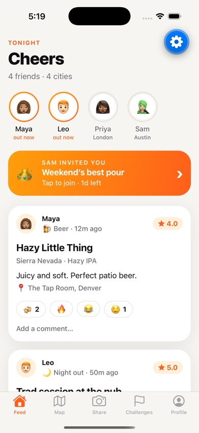
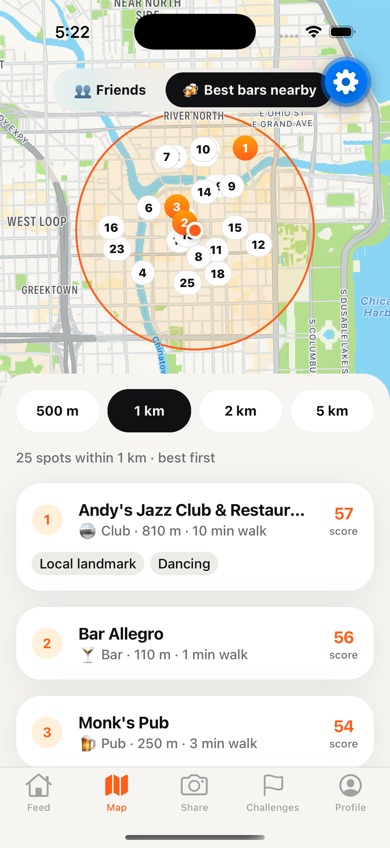
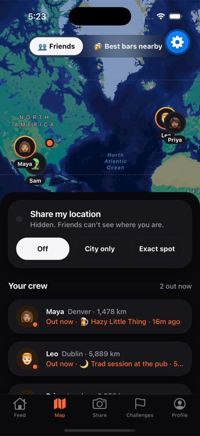
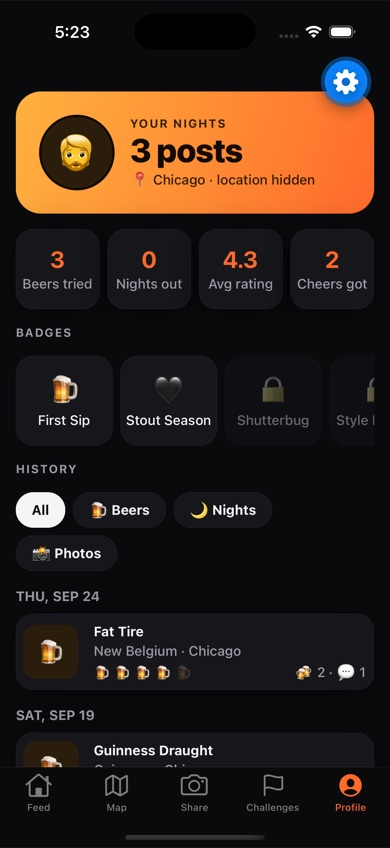

# Cheers 🍻

A social app for friends to capture, rate and share their nights out drinking beer, even when they're in different cities.

**Go out → snap it → rate it → share it → friends react → join a challenge → go out again.**

Cheers is a working **demo**: it runs entirely on the phone with sample friends who react to your posts, so the whole social loop can be tried without a backend.

<p>
  
  
  
  
</p>

## Features

Five screens:

| Screen | What it does |
|---|---|
| **Feed** | Friends' beers, nights out and check-ins. React with 🍻 🔥 😂 🤤, comment inline, pull to refresh for new posts. "Out now" row and a banner for your current challenge. |
| **Map** | **Friends:** see friends around the world, share your own location (off / city only / exact spot), add friends. **Best bars nearby:** pick a radius (500 m – 5 km) and get ranked bars, pubs and clubs with walking time, directions and one-tap check-in. |
| **Share** | Post a 🍺 beer rating, a 🌙 night-out recap or a 📍 casual check-in, with a photo from the camera or library. |
| **Challenges** | Weekly challenges with friends ("Three new beers", "Two nights out", "Cheers across the globe"), invites, leaderboards and an end-of-challenge recap. |
| **Profile** | Stats, badges and a day-by-day history of your beers, nights and photos. |

Rewards are built in: posting, rating, reactions and finished challenges trigger short animations, haptics and a chime. Friend activity arrives as in-app banners and, when the app is in the background, as local notifications.

## Getting started

**Requirements:** Node 20.19 or newer, and the [Expo Go](https://expo.dev/go) app on your phone (or Xcode / Android Studio for simulators).

```bash
npm install
npx expo start
```

Then scan the QR code with your phone's camera (iOS) or Expo Go (Android), or press `i` / `a` to open a simulator. Your phone and computer need to be on the same Wi‑Fi; if they can't see each other, use `npx expo start --tunnel`.

Everything the app uses ships inside Expo Go, so no custom native build is needed.

### Useful commands

```bash
npx tsc --noEmit   # typecheck
npx expo lint      # lint
npx expo-doctor    # check dependencies and config
```

## How the demo works

- **No backend.** Friends, posts and challenges are sample data (`src/data/seed.ts`). After you post, simulated friends react and comment over the next ~15 seconds.
- **Saved on the device.** Your posts and photos persist between launches. *Profile → Reset demo data* restores the sample content.
- **Location** is only requested when you turn on location sharing or search for bars. Friends' locations are fixed sample positions.
- **Bars** come from [OpenStreetMap](https://www.openstreetmap.org/copyright) via the free public Overpass API. OpenStreetMap has no ratings, so "best" is a Cheers score: your crew's Cheers ratings for a venue first, then what the listing offers (brews its own beer, notable place, outdoor seating, …) and distance. The public server is sometimes overloaded; the app retries and shows a "try again" card if it can't get through.
- **Notifications** are local only. Remote push isn't available in Expo Go on Android and would need a development build.

## Tech stack

[Expo](https://expo.dev) SDK 57 · React Native 0.86 · React 19 with the React Compiler · TypeScript · Expo Router (native tabs) · Reanimated · react-native-maps · expo-location, expo-image-picker, expo-haptics, expo-audio, expo-notifications, expo-file-system.

## Project structure

```
src/
  app/          Screens (Expo Router): index (Feed), map, post (Share), challenges, profile
  components/   UI building blocks: cards, buttons, post and challenge cards, map, panels
  data/         Types, sample data, the app store (state + simulated friends), challenge logic, persistence
  feedback/     Rewards: haptics, sounds, toasts and the celebration overlay
  lib/          Location, geo helpers, bar search, notifications
  constants/    Theme: colors (light + dark), spacing, radii
assets/sounds/  Chime and pop sound effects
```

Developer notes on architecture and conventions are in [CLAUDE.md](CLAUDE.md).
